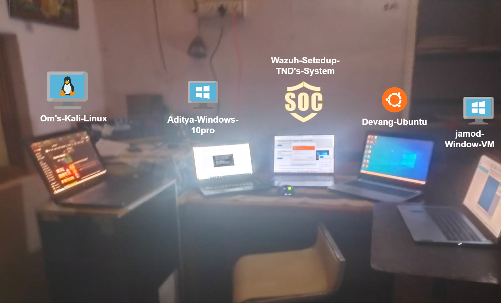
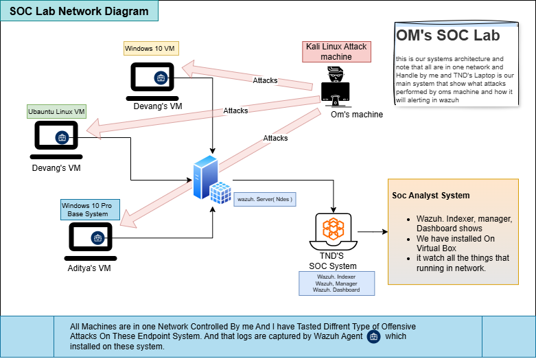

# 🛡️ Enterprise SOC Detection & Response Lab using Wazuh

  

## 🔍 Project Overview

This project demonstrates a **real-world Security Operations Center (SOC)**
environment built using **Wazuh SIEM** to monitor, detect, and analyze
security threats across **Windows and Linux endpoints**.

Unlike basic labs, this repository focuses on:
- 📌 **Detection engineering**
- 📌 **Evidence-based SOC investigations**
- 📌 **MITRE ATT&CK aligned detections**
- 📌 **Analyst triage & response workflows**

All detections were validated using **live attack simulations** in a
controlled lab environment.

---

## 🧪 Real SOC Lab Setup (Physical Environment)

  

This image represents the **actual physical SOC lab environment**
used to build and validate this project.

### Lab Highlights
- Multiple systems running simultaneously to simulate a real SOC workload
- Separate machines for:
  - 🛡️ SOC Monitoring (Wazuh Manager & Dashboard)
  - 🐧 Linux Endpoint (Ubuntu – Devang)
  - 🪟 Windows Endpoints (Aditya, Jamod)
  - ⚔️ Attacker Machine (Kali Linux)
- All systems connected within a controlled internal network

### Why This Matters
Unlike simulated screenshots or single-VM labs, this setup demonstrates:
- Real-time attack execution
- Concurrent alert generation
- Analyst-side investigation under realistic conditions

> This setup reflects how SOC analysts operate in real environments,
monitoring multiple endpoints while responding to active threats.

---

## 🎯 Why This Project Is Different

✅ Not just log collection  
✅ Not just screenshots  
✅ Not just theory  

This project shows:
- *How attacks look from attacker side*
- *How Wazuh detects them*
- *How a SOC analyst investigates them*
- *How evidence is documented*

> This mirrors how enterprise SOC teams operate daily.

---

## 🧱 SOC Lab Architecture

  

### Components
- **Wazuh Manager & Dashboard** – Central SIEM
- **Windows 10 Endpoints** – Aditya, Jamod
- **Ubuntu Linux Endpoint** – Devang
- **Kali Linux** – Attacker simulation
- **Slack Integration** – Real-time alerting

---

## ⚙️ SOC Workflow Implemented

  

1. Event generation on endpoint  
2. Log collection via Wazuh agent  
3. Correlation & rule evaluation  
4. Alert generation  
5. SOC triage & investigation  
6. Evidence documentation  

---

## 🚨 Detection Use Cases Implemented

### 🐧 Ubuntu – Devang (Linux Endpoint)

#### 🔐 SSH Brute Force
- Detects repeated SSH authentication failures
- Logs analyzed from `auth.log`
- MITRE: **T1110 – Brute Force**

  

---

#### 🌐 Nmap Network Scan Detection
- Detects active reconnaissance & port scanning
- Uses vulnerability & threat detection telemetry
- MITRE: **T1046, T1595**

  

---

### 🪟 Windows – Aditya (Windows 10)

#### 🔑 Failed Login Attempts
- Detects repeated authentication failures
- Windows Event ID **4625**
- MITRE: **T1110**

  

---

#### 🌐 Network Reconnaissance (Nmap)
- Detects service enumeration & port scanning
- MITRE: **T1046, T1595**

---

#### 🖥️ RDP Brute Force
- Detects brute-force attempts over RDP
- Logon Type **10**
- MITRE: **T1110, T1021.001**

  

---

### 🪟 Windows – Jamod (Windows 10)

#### 🖥️ RDP Brute Force
- High-severity RDP authentication failures
- Evidence correlated with MITRE dashboards

---

## 🧠 Evidence-Driven SOC Documentation

Every detection includes:
- 📸 Screenshots (Dashboards & alerts)
- 📄 Logs (OS-level)
- 🎥 Attack & detection videos
- 🧭 MITRE ATT&CK mapping
- 🧾 Analyst investigation notes

👉 Central index available in: 03-Detection-Use-Cases/evidence-index.md

---

## 📊 Dashboards & Threat Visibility

  

Dashboards used:
- MITRE ATT&CK
- Threat Hunting
- Vulnerability Detection
- Authentication Monitoring
- Agent Health

---

## 📐 Standards & Framework Alignment

- **MITRE ATT&CK** – Detection mapping & reporting
- **NIST 800 Concepts** – Monitoring & detection principles
- **SOC Best Practices** – Triage, escalation, documentation

---

## 🧪 Ethical Disclaimer

All activities were performed in a **controlled lab environment**.
No production systems, real users, or unauthorized networks were involved.

📄 See `DISCLAIMER.md` for details.

---

## 👤 Author

**Om Gohel**  
SOC Analyst | Blue Team | SIEM | Wazuh  
GitHub: https://github.com/THeOLdMAn48  

---

## 🚀 What This Project Demonstrates

✔ SOC analyst mindset  
✔ Detection engineering skills  
✔ Log analysis & correlation  
✔ Incident investigation  
✔ Professional documentation  

> This repository represents **real SOC proof-of-work**, not a tutorial lab.
